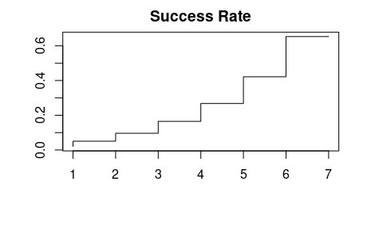
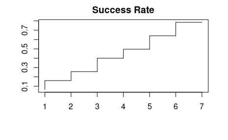

```{r setup, include=FALSE}
knitr::opts_chunk$set(echo = TRUE)
```

## Smith is in jail and has 1 dollar; he can get out on bail if he has 8 dollars.  A guard agrees to make a series of bets with him. If Smith bets A dollars, he wins A dollars with probability .4 and loses A dollars with probability .6.

>Find the probability that he wins 8 dollars before losing all of his money if:

## (a) he bets 1 dollar each time (timid strategy).

We can analayze this as an absorbing markov chain.

```{r message=FALSE}
library(markovchain)
p <- 0.4
q <- 1 - p
```

For a transition matrix $P$ in canonical form:

\[P = \bigg( \begin{array}{cc}
  I & R \\
  0 & Q \\ \end{array}\bigg)\]
\[N = (I - Q)^{-1}\]

```{r}
fundamental_matrix <- function(markov_chain_object) {
    # N = (I - Q)^-1
  m <- markov_chain_object
  
  r <- length(unlist(absorbingStates(m)))
  t <- length(unlist(transientStates(m)))
  
  P <- as(canonicForm(m), "matrix")
  I <- diag(t)

  Q <- P[(r+1):(r+t), (r+1):(r+t)]
  N <-  solve(I - Q)
  return(list(N, P, r))
}
```

\clearpage

\[B = N R\]

```{r}
absorbing_chain_probabilities <- function(m) {
  # B = NR
  x <- fundamental_matrix(m)
  N <- x[[1]]
  P <- x[[2]]

  r <- as.numeric(x[[3]])
  t <- dim(N)[1]
  
  R <- P[(r+1):(r+t), 1:r]
  B <- N %*% R
  
  return(B)
}
```

```{r}
m_a <- matrix(c(1, rep(0, 8),
              q, 0, p, rep(0, 6),
              0, q, 0, p, rep(0, 5),
              rep(0, 2), q, 0, p, rep(0, 4),
              rep(0, 3), q, 0, p, rep(0, 3),
              rep(0, 4), q, 0, p, rep(0, 2),
              rep(0, 5), q, 0, p, 0,
              rep(0,6), q, 0, p,
              rep(0,8), 1), nrow = 9, byrow = TRUE,
            dimnames = list(c(0:8), c(0:8)))

(mc_a <- new('markovchain', transitionMatrix = m_a, states = colnames(m_a)))
```

\clearpage

```{r}
#absorbing_chain_probabilities(mc_a)
#plot(absorbing_chain_probabilities(mc_a)[,2],
#     type='S', main='Success Rate', xlab='', ylab='')
```

\[\begin{tabular}{c c c}
  & 0 & 8 \\
1 & 0.9796987 & 0.02030135 \\
2 & 0.9492466 & 0.05075337 \\
3 & 0.9035686 & 0.09643140 \\
4 & 0.8350515 & 0.16494845 \\
5 & 0.7322760 & 0.26772403 \\
6 & 0.5781126 & 0.42188739 \\
7 & 0.3468676 & 0.65313243 \\
  \end{tabular}\]



The probability of getting to \$8 from \$1 with this strategy is $\approx 0.0203$.

\clearpage

## (b) he bets, each time, as much as possible but not more than necessary to bring his fortune up to 8 dollars (bold strategy).

```{r}
m_b <- matrix(c(1, rep(0,8),
                 q, 0, p, rep(0,6),
                 q, rep(0,3), p, rep(0,4),
                 q, rep(0,5), p, rep(0,2),
                 q, rep(0,7), p,
                 rep(0,2), q, rep(0,5), p,
                 rep(0,4), q, rep(0,3), p,
                 rep(0,6), q, 0, p,
                 rep(0,8), 1),
               nrow = 9, byrow = TRUE,
               dimnames = list(c(0:8), c(0:8)))

(mc_b <- new('markovchain', transitionMatrix = m_b, states = colnames(m_b)))

#absorbing_chain_probabilities(mc_b)
#plot(absorbing_chain_probabilities(mc_b)[,2], type='S', main='Success Rate', xlab='', ylab='')
```

\[\begin{tabular}{c c c}
  & 0 & 8 \\
1 & 0.936 & 0.064 \\
2 & 0.840 & 0.160 \\
3 & 0.744 & 0.256 \\
4 & 0.600 & 0.400 \\
5 & 0.504 & 0.496 \\
6 & 0.360 & 0.640 \\
7 & 0.216 & 0.784 \\
  \end{tabular}\]

\clearpage



The probability of getting to \$8 from \$1 with this strategy is $\approx 0.064$.

## (c) Which strategy gives Smith the better chance of getting out of jail?

The adaptive strategy gives a better chance from every starting state.

NOTE: solve(I-Q) causes the knit function to hang... However, you can run the code from the .Rmd file after uncommenting the lines above the figures.