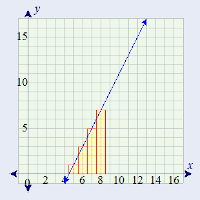

```{r setup, include=FALSE}
knitr::opts_chunk$set(echo = TRUE)
```

### 1. Use integration by substitution to solve the integral below.

\[\int 4e^{-7x}dx\]

### 2. Biologists are treating a pond contaminated with bacteria.  The level of contamination is changing at a rate of $\frac{dN}{dt} = -\frac{3150}{t^4} - 220$ bacteria per cubic centimeter per day, where $t$ is the number of days since treatment began.  Find a function $N(t)$ to estimate the level of contamination if the level after 1 day was 6530 bacteria per cubic centimeter.

### 3. Find the total area of the red rectangles in the figure below, where the equation of the line is $f(x) = 2x - 9$.



### 4. Find the are of the region bounded by the graphs of the given equations:
\[y = x^2 - 2x -2\]
\[y = x + 2\]

### 5. A beauty supply store expects to sell 110 flat irons during the next year.  It costs $3.75 to store on flat iron for one year.  There is a fixed cost of $8.25 for each order.  Find the lot size and the number of orders per year that will minimize inventory costs.


